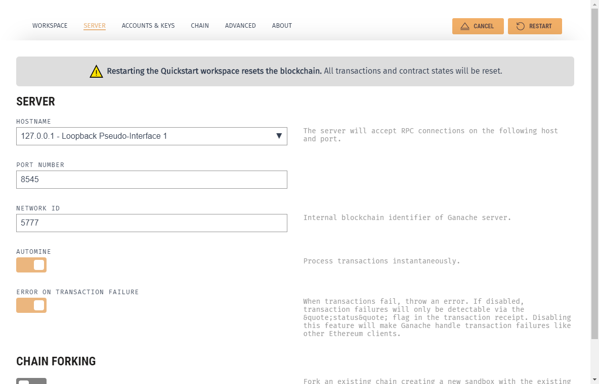
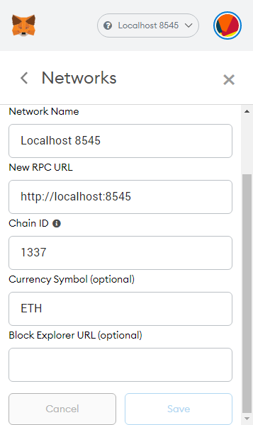

## Set up

### Install a local server

[Ganache](https://www.trufflesuite.com/ganache) is a great GUI for quickly spinning up an easily usable local blockchain in just a few clicks. **This is the recommended route for this course**, since we won't be able to spend a lot of time helping everyone get a more complicated solution up and running. Feel free to explore the other solutions if you're feeling adventurous.

If you want to explore the [Truffle CLI](https://www.trufflesuite.com/truffle) for yourself, it also comes with a development server.

Alternatively, you can download and run a [full Ethereum node](https://geth.ethereum.org/) for your dApp development setup.

### Install Metamask

[Metamask](https://metamask.io/) is a browser extension that allows websites to connect to an Ethereum network, whether mainnet, testnet, or any other RPC provider (like a local Ganache instance).

### Install Node.js

[Node.js](https://nodejs.org/) is a local JavaScript runtime that comes with the Node Package Manager (NPM), which we will use to install Truffle.

### Install Truffle CLI

Truffle is a suite of command-line tools for dApp development.

Once you have NPM installed, installing Truffle is as simple as running this command:

```txt
$ npm install -g truffle
```

Double-check everything is working by running:

```txt
$ truffle version
Truffle v5.3.7 (core: 5.3.7)
Solidity v0.5.16 (solc-js)
Node v14.16.1
Web3.js v1.3.6
```

### Install updated Solidity compiler

Truffle's built-in Solidity compiler isn't always the latest version, so let's install a more up-to-date one:

```txt
$ npm install -g solc@latest
```

Double-check everything is working by running:

```txt
$ solcjs --version
0.8.4+commit.c7e474f2.Emscripten.clang
```

## Start your blockchain

1. Open up Ganache.


2. Press on the big "Quickstart" button.
3. Your blockchain is running!


4. Click on the settings cog icon and go to the "Server" tab. Make sure the port number is set to 8545, then save and restart Ganache.



## Prepare a contract to deploy

You may deploy a contract you have already written, or feel free to use [this one](https://github.com/bafnetwork/web3ttt/blob/main/examples/04/contracts/PyramidScheme.sol) as a sample.

## Deploy using Remix

Remix IDE is a surprisingly capable browser-based development environment. One of its most useful features is the ability to connect to different web3 providers.

### Injected Web3

**Injected Web3** refers to the way that extensions like MetaMask support web3 integration: injecting a global JavaScript object into the page that provides handles to various pieces of functionality within a selected Ethereum network.

MetaMask comes with a custom RPC configuration for `localhost:8545` networks by default, which makes it easier for us. If you don't have that configuration or would like to set up another one, use the following configuration:



Select the local network configuration, then import an account from Ganache:

1. Click on the "Import Account" button in MetaMask.


2. Copy the private key from any account in Ganache.


3. Paste it into MetaMask and click "Import".


Open up Remix IDE and navigate to the "Deploy & Run Transactions" side panel.


Choose "Injected Web3" from the "Environment" dropdown. MetaMask should open up and ask you to confirm the connection to the website.

Now, when contracts are deployed from Remix, instead of only existing in-browser, the contracts will actually be deployed onto your local blockchain, and you will be able to observe activity from Ganache's interface.

This approach is good to know because it is flexible: you can easily configure MetaMask to connect to any RPC network you desire, not just a local one.

### Web3 Provider

The other way to connect Remix IDE to your local blockchain bypasses MetaMask entirely. First, ensure that the web address you're using to access Remix does *not* start with `https`. Then, you can select "Web3 Provider" from the "Environment" dropdown, and paste in `http://127.0.0.1:8545`, adjusting for whatever port Ganache is running on. If you plan on writing contracts in Remix using a local blockchain, this is probably a better long-term solution.

## Deploy from local project

### Truffle Suite

If you don't wish to write and test your contracts in Remix, you can use the Truffle Console to connect to Ganache locally, allowing you to use the editor of your choice in your development. Truffle Console (or Truffle Develop) is our recommended development setup for large or long-term projects. However, it requires a bit of configuration and doesn't provide GUI's to help you along. You can find our example Truffle project [here](https://github.com/bafnetwork/web3ttt/tree/main/examples/04) and customize it to fit your needs. Otherwise, you can run `truffle init` in an empty directory to start from scratch.

The first thing to do is make sure that your `truffle-config.js` file knows how to connect to your local blockchain instance. Find the bit of code that looks like this and add your connection information.

```js
development: {
  host: '127.0.0.1',
  port: 8545,
  network_id: '*',
},
```

Also find the section that looks like this and add the version of Solidity you want to use:

```js
compilers: {
  solc: {
    version: '0.8.4',
```

Now you should be able to run `truffle console` from the same directory as `truffle-config.js` and receive a prompt connected to the blockchain from which you can deploy and manage your project during development.

```txt
$ truffle console
truffle(development)>
```

This acts pretty much like a JavaScript REPL[^repl] with Truffle, Web3 utilities, and proxies to your compiled contracts in scope, along with a few extra commands. Here's a useful selection:

[^repl]: **R**ead **E**val **P**rint **L**oop

- `compile` compiles all of your contracts
- `migrate` runs any new migrations that haven't been run yet
- `migrate --reset` runs all of the migrations in order from the beginning
- `test <path-to-test-script>` runs a test (keep your tests in the `test/` directory)

This setup is pretty friendly to test-driven development (which is a great paradigm for writing smart contracts). [Check out the sample test](https://github.com/bafnetwork/web3ttt/blob/main/examples/04/test/PyramidScheme.test.js).

In the Truffle Console, your compiled contracts will be available, and if they have been deployed by the migrations scripts, you can grab an instance of the deployed contract by writing something like the following:

```js
let instance = await MyContract.deployed();
```

You can interact with the contract using the `instance` variable.

To call view methods:

```js
instance.myViewMethod.call(param1, param2, {
  from: '0xADDRESS',
});
```

To run transactions:

```js
instance.myFunction(param1, param2, {
  from: '0xADDRESS',
  value: web3.utils.toWei('1', 'ether'),
  gas: '300000',
  gasPrice: web3.utils.toWei('20', 'gwei'),
});
```

The configuration object and its properties (everything in `{` curly braces `}`) are optional for both view and transaction calls, so you only need to include them if the call requires them.

### Local geth testnet

Although we won't go over this method in detail in this course, we encourage you to at least read a little about how geth works. This is an excellent two-part guide that will get you up-and-running with a local geth testnet instance. (If you installed the Solidity compiler as described [above](), the executable is called `solcjs` instead of just `solc`.)

- Part 1: [How to Set Up a Private Ethereum Blockchain using Geth](https://arvanaghi.com/blog/how-to-set-up-a-private-ethereum-blockchain-using-geth/)
- Part 2: [Testing Smart Contracts Locally using Geth](https://arvanaghi.com/blog/testing-smart-contracts-on-a-private-blockchain-with-Geth/)

## Project Status Update

Put the finishing touches on your smart contract, and then write some tests for it! You can use whatever development setup you want. Don't forget to emit any events you may need to listen for, since we're going to be writing the web app next!
