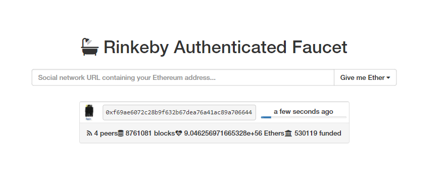
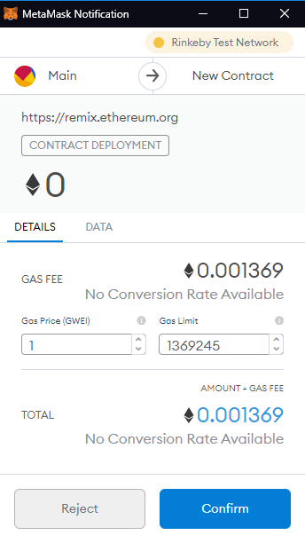
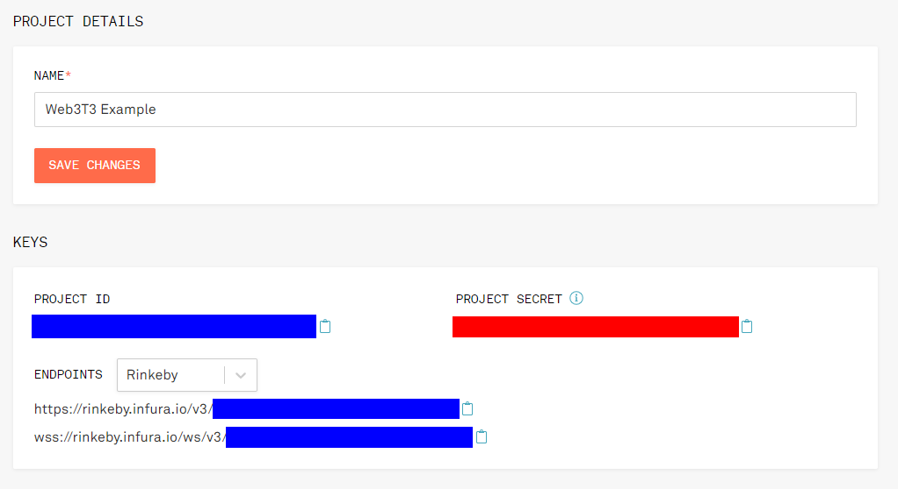

## What is a testnet?

Recall that smart contracts deployments are irreversible: once you deploy a contract, it's on the network for good. Code added to the blockchain is **immutable** and cannot be modified.[^selfdestruct] This means that we have to be _really sure_ that what we deploy is really what we want to deploy, and that means _lots and lots of testing_. No take-backsies!

[^selfdestruct]: Unless, of course, you call [`selfdestruct`](https://docs.soliditylang.org/en/v0.8.4/introduction-to-smart-contracts.html#deactivate-and-self-destruct), which is not particularly common

Of course, local testing on our own local blockchain can only get us so far. That's why there are **testnets**. These are Ethereum protocol-compatible networks that typically distribute tokens for free so that smart contract developers can deploy their contracts to their network first for more realistic testing.

Instead of using proof-of-work, some of these networks use **proof-of-authority** (PoA) for their consensus mechanism to facilitate such features as free token distribution while also keeping costs and complexity low. PoA relies on trusted parties for validation, and is therefore not decentralized, but that should be fine in a testnet.

### Exercise

What's another reason that it might be useful to use a non-decentralized consensus mechanism like PoA in a testnet? Why might it be better to use PoW in a testnet?

[This is a good article](https://medium.com/blockcentric/ethereum-testnets-what-are-they-and-why-so-many-ebf62821bbc) if you're interested in reading a little more about the details of the Ethereum testnets.

## Funding a Rinkeby.io testnet account

For the purposes of this course we'll be using the [Rinkeby testnet](https://www.rinkeby.io/). However, don't feel tied to any one particular testnet. Although the process of obtaining starter tokens may be a little different, as long as your provider supports the testnet, you'll be fine.

To obtain some free Ether on the Rinkeby testnet, head over to [the faucet page](https://www.rinkeby.io/#faucet), and follow the instructions there.



You'll need a Twitter or Facebook account to make a public post containing the address you wish to fund. It's pretty easy, just paste your address into a tweet, and then paste the link to the tweet into the field on the faucet page. You can delete the tweet afterward if you prefer.

Now just click on the "Give me Ether" button and select whichever timeframe you prefer.


Congratulations, now you have some Ether to spend on the Rinkeby testnet!


## Deploying from Remix with MetaMask

The Remix IDE + MetaMask setup can be really nice, because Remix's process for deploying a contract is the same whether we're deploying to the integrated JavaScript VM, a local blockchain, or a live network. Simply connect your MetaMask, select the contract to deploy, and click on the "Deploy" button.



## Deploying our Truffle project with Infura

Much of what is explained here is in [the sample](https://github.com/bafnetwork/web3ttt/tree/main/examples/06).

Instead of relying on websites and browser extensions to deploy our contracts, we can set up a significantly more robust deployment solution using Truffle's suite of tools and Infura's HTTP provider.

### Create Infura account

Creating an Infura account is pretty easy, just go to [their website](https://infura.io/) and follow the steps. Infura is free for up to three projects and is limited to 100,000 requests per day.

### Save project credentials


After creating an Infura account and project, we'll need to find the <span style="color:#00f;font-weight:bold">project ID</span> and <span style="color:red;font-weight:bold">project secret</span>.




You'll also need the 12-word mnemonic associated with your testnet account.

Copy and paste each of these values into a file named `.env` in your project root directory like so:

```env
MNEMONIC="<12-word-mnemonic>"
PROJECT_ID="<project-id>"
PROJECT_SECRET="<project-secret>"
```

Note that you only need the project secret if you check the "Require project secret for all requests" checkbox.

### Set up NPM project

If your contracts are already in an NPM project, great. If not, run this command in your project's root directory to create one:

```txt
$ npm init -y
```

### Install dependencies

We'll need to add two dependencies:

```txt
$ npm install --save-dev @truffle/hdwallet-provider dotenv
```

- [`@truffle/hdwallet-provider`](https://www.npmjs.com/package/@truffle/hdwallet-provider) creates a Web3 provider from a 12-word mnemonic and the URL of the host.[^hdwallet]
- [`dotenv`](https://www.npmjs.com/package/dotenv) allows us to easily store credentials in another file so that they won't get added to version control.

[^hdwallet]: An HD (**H**ierarchical **D**eterministic) wallet can generate a series of addresses from a 12-word mnemonic. [More details](https://www.investopedia.com/terms/h/hd-wallet-hierarchical-deterministic-wallet.asp)

### Create network configuration

Paste this at the top of your `truffle-config.js`:

```js
const HDWalletProvider = require('@truffle/hdwallet-provider');
require('dotenv').config();

const mnemonic = process.env['MNEMONIC'];
const projectId = process.env['PROJECT_ID'];
```

Then, add a `rinkeby` key to `networks`, and fill in the following:

```js
rinkeby: {
  provider: () =>
    new HDWalletProvider( // Construct a new HD wallet provider
      mnemonic, // 12-word mnemonic for a funded wallet
      'https://rinkeby.infura.io/v3/' + projectId, // Host URL
    ),
  network_id: 4, // Rinkeby's network ID
  gas: 6700000, // Varies
  gasPrice: 10000000000, // See https://rinkeby.etherscan.io/blocks
},
```

For more information about how to calculate the `gas` and `gasPrice` values, see [this StackExchange answer for a breakdown of costs](https://ethereum.stackexchange.com/a/37898) and [this StackExchange answer for how to compute an estimate](https://ethereum.stackexchange.com/a/40164).

### Run migrations on a selected network

Once the network configuration is all set up, we can run our Truffle migrations on the Rinkeby testnet:

```txt
$ truffle migration --network rinkeby
```

And with any luck, we'll be able to see [our contract on the Rinkeby testnet](https://rinkeby.etherscan.io/address/0xd404253b132af251366e113be5f2c98004c1bcde)!


## Project Status Update

Deploy your dapp on a testnet (not necessarily Rinkeby) and show it off to the class! Be prepared to demonstrate and explain the deployment process you built in detail.
